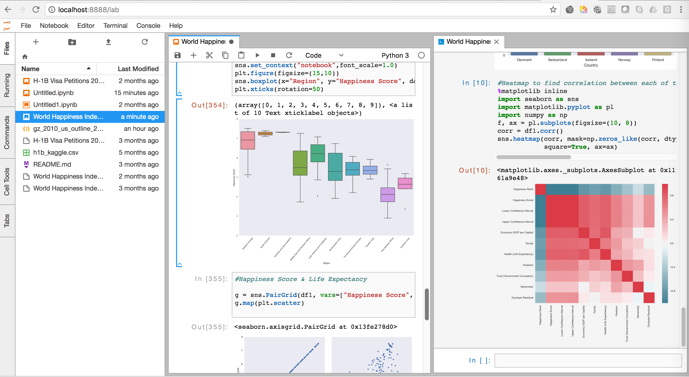

# 机器/深度学习环境

2023/04/20

`Miniconda` + `JupyterLab`

## Miniconda

**`conda`**可以理解为一个工具，也是一个可执行命令，其核心功能是**包管理**与**环境管理**。`conda`将几乎所有的工具、第三方包都当做package对待，甚至包括`python`和`conda`自身

**`Anaconda`** = `conda`+`python`+`数据科学第三方包`

**`Miniconda`** = `python`+`conda`


**安装**

- 清华镜像站
  https://mirrors.tuna.tsinghua.edu.cn/anaconda/miniconda/Miniconda3-latest-Windows-x86_64.exe
  
- Anaconda官网

  https://repo.anaconda.com/miniconda/Miniconda3-latest-Windows-x86_64.exe

不要选`Register Miniconda3 as my default Python3.x`

**启动**

运行`%appdata%\Microsoft\Windows\Start Menu\Programs\Miniconda3 (64-bit)`

```bash
(base) miaow@miaow-vmu20:~$
```

**查看已有环境/当前环境python版本**

```bash
(base) miaow@miaow-vmu20:~$ conda env list
# conda environments:
#
base                  *  /home/miaow/miniconda3
deepo                    /home/miaow/miniconda3/envs/deepo
```

```bash
(base) miaow@miaow-vmu20:~$ python -V
Python 3.10.8
(base) miaow@miaow-vmu20:~$ pip -V
pip 22.2.2 from /home/miaow/miniconda3/lib/python3.10/site-packages/pip (python 3.10)
```

**新建/删除环境**

```bash
(base) miaow@miaow-vmu20:~$ conda create -n 环境名 默认安装的包
```

- 默认安装的包：
  - 空——新环境暂不安装任何包
  - python=3.10——python3.10的latest版本，python3.10.9
  - python——python 3的latest版本，python3.10.9
  - python=3.9 numpy pandas——安装python3.9.16 numpy1.23.5 pandas1.5.3

```bash
(base) miaow@miaow-vmu20:~$ conda remove -n 环境名 --all
```

**换源**

源是针对所有环境的，运行`conda config --set show_channel_urls yes`生成配置文件，修改`%userprofile%/.condarc`

```yaml
channels:
  - defaults
show_channel_urls: true
default_channels:
  - https://mirrors.tuna.tsinghua.edu.cn/anaconda/pkgs/main
  - https://mirrors.tuna.tsinghua.edu.cn/anaconda/pkgs/r
  - https://mirrors.tuna.tsinghua.edu.cn/anaconda/pkgs/msys2
custom_channels:
  conda-forge: https://mirrors.tuna.tsinghua.edu.cn/anaconda/cloud
  msys2: https://mirrors.tuna.tsinghua.edu.cn/anaconda/cloud
  bioconda: https://mirrors.tuna.tsinghua.edu.cn/anaconda/cloud
  menpo: https://mirrors.tuna.tsinghua.edu.cn/anaconda/cloud
  pytorch: https://mirrors.tuna.tsinghua.edu.cn/anaconda/cloud
  pytorch-lts: https://mirrors.tuna.tsinghua.edu.cn/anaconda/cloud
  simpleitk: https://mirrors.tuna.tsinghua.edu.cn/anaconda/cloud
```

运行 `conda clean -i` 清除索引缓存，保证用的是清华源的索引

**切换当前环境**

切换到deepo环境

```bash
(base) miaow@miaow-vmu20:~$ conda activate learn
(learn) miaow@miaow-vmu20:~$
```

**当前环境中安装/删除/更新包**

```bash
(learn) miaow@miaow-vmu20:~$ conda install 包名
```
默认安装的包：

- python=3.9——python3.9的latest版本，python3.10.12
- python=3——python 3的latest版本，python3.10.9
- python=3.9 numpy pandas=1.5——安装python3.9.16 numpy1.23.5 pandas1.5.3

```bash
(learn) miaow@miaow-vmu20:~$ conda remove 包名不用指定版本
```

```bas
(learn) miaow@miaow-vmu20:~$ conda update 包名
```

## JupyterLab

try online：https://jupyter.org/try-jupyter/lab/



在**base环境**安装

```powershell
(base) C:\Users\guoyr>conda install jupyterlab
```

**启动**

```powershell
(base) C:\Users\guoyr>jupyter lab
```

**修改配置**

```powershell
(base) C:\Users\guoyr>jupyter lab --generate-config
Writing default config to: C:\Users\guoyr\.jupyter\jupyter_lab_config.py
```

修改`%userprofile%\.jupyter\jupyter_lab_config.py`

```python
# 设置为*，服务器监听所有ip，意味着允许所有ip访问，需要配置windows高级防火墙
c.ServerApp.ip = '*'
# 可以设置密码
# >>> from jupyter_server.auth import passwd; passwd()
c.NotebookApp.password = 'sha1:...'
# 是否自动在服务器上打开浏览器
c.ServerApp.open_browser = False
# 监听端口设置为8888
c.ServerApp.port = 8888
# 允许远程访问
c.Server.allow_remote_access = True
# 设置默认工作目录
c.ServerApp.root_dir = r'D:\OneDrive\python development'
```

**注册环境**

在`learn`环境中安装`ipykernal`

```powershell
(base) C:\Users\guoyr>conda install -n learn ipykernel
也可以
(base) C:\Users\guoyr>conda activate learn
(learn) C:\Users\guoyr>conda install ipykernel
```

进入`learn`环境中注册，

```powershell
(learn) C:\Users\guoyr>python -m ipykernel install --user --name 环境名 --display-name "显示的名字"
```

