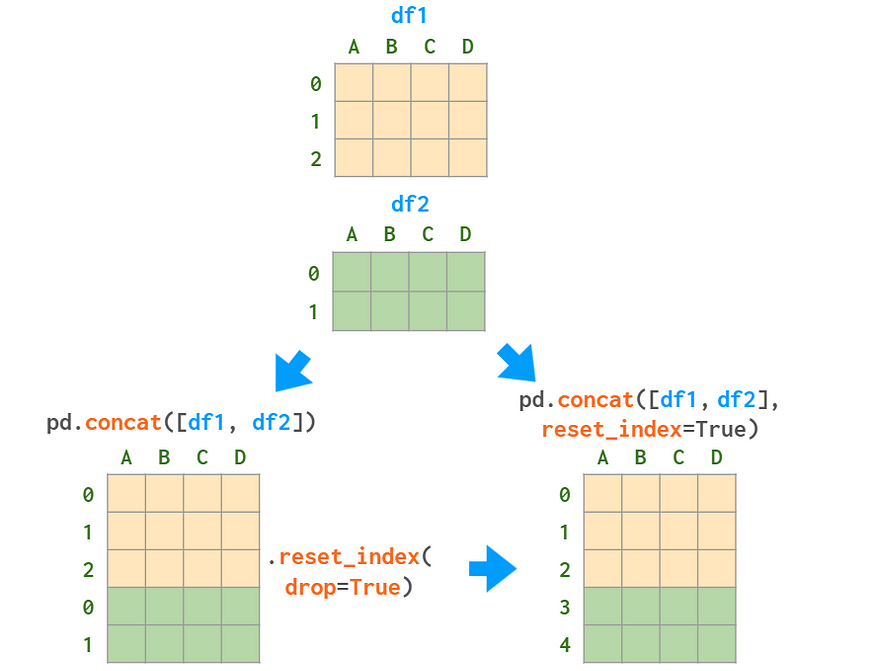
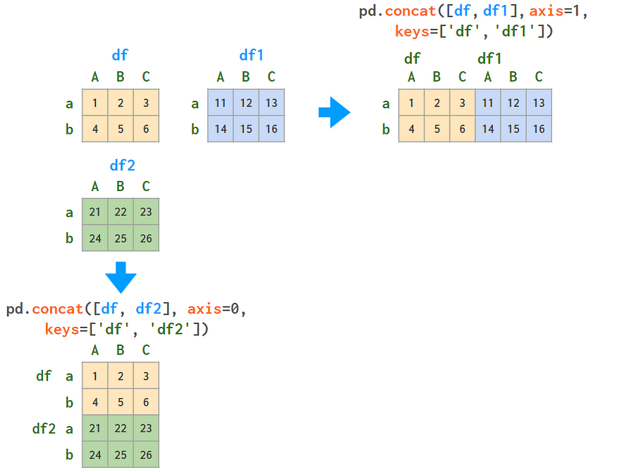
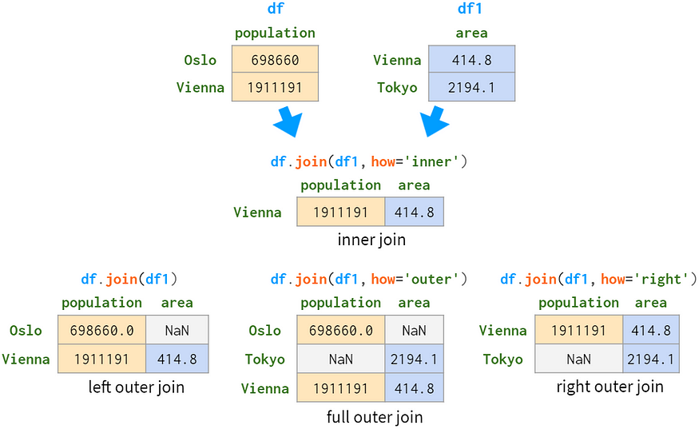
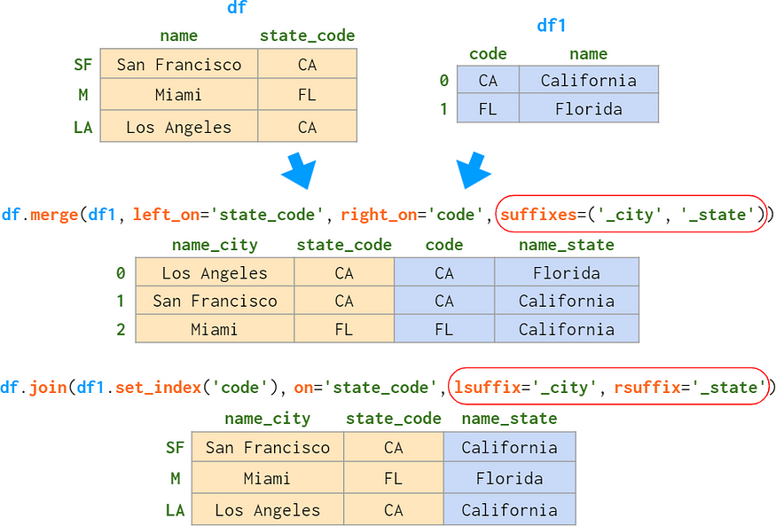
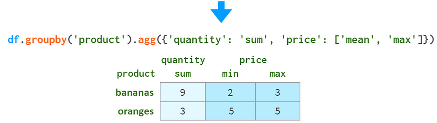
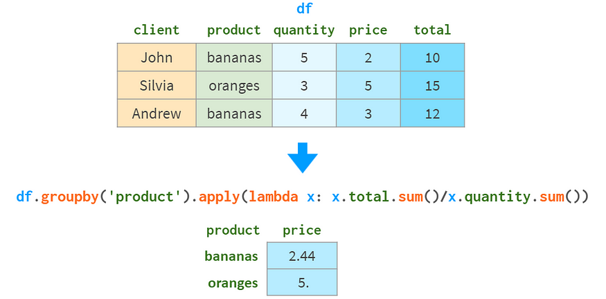
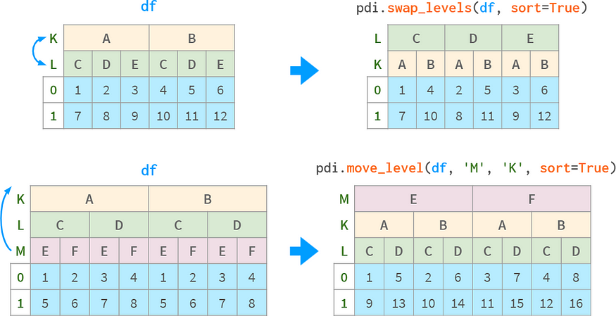
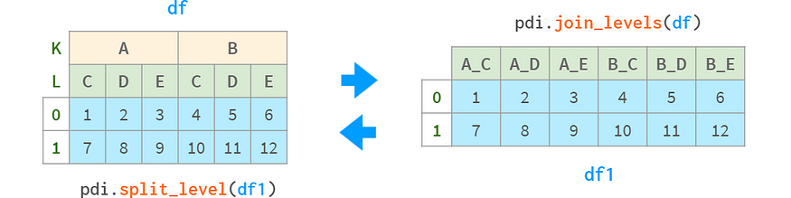

# Pandas Illustrated: The Definitive Visual Guide to Pandas


[Pandas](https://pandas.pydata.org/) is an industry standard for analyzing data in Python. With a few keystrokes, you can load, filter, restructure, and visualize gigabytes of heterogeneous information. Built on top of the NumPy library, it borrows many of its concepts and syntax conventions, so if you are comfortable with NumPy, you’ll find Pandas a pretty familiar tool. And even if you’ve never heard of NumPy, Pandas provides a great opportunity to crack down on data analysis problems with little or no programming background.

There are a lot of Pandas guides out there. In this particular one, you’re expected to have a basic understanding of NumPy. If you don’t, I’d suggest you skim through the [NumPy Illustrated](https://betterprogramming.pub/numpy-illustrated-the-visual-guide-to-numpy-3b1d4976de1d?sk=57b908a77aa44075a49293fa1631dd9b) guide to get an idea of what a NumPy array is, in which ways it is superior to a Python list, and how it helps avoid loops in elementary operations.

Two key features that Pandas brings to NumPy arrays are:

1. Heterogeneous types — each column is allowed to have its own type;
2. Index — improves lookup speed for the specified column(s).

It turns out these features are enough to make Pandas a powerful competitor to both spreadsheets and databases.

[Polars](https://www.pola.rs/), the recent reincarnation of Pandas (written in Rust, thus [faster](https://towardsdatascience.com/pandas-vs-polars-a-syntax-and-speed-comparison-5aa54e27497e#e87a)¹) doesn’t use NumPy under the hood any longer, yet the syntax is pretty similar, so learning Pandas will let you feel at ease with Polars as well.

The article consists of four parts:

Part 1. Motivation
Part 2. Series and Index
Part 3. DataFrames
Part 4. MultiIndex

… and is quite lengthy, though easy to read as it is mostly images.

For a 1-minute read of the “first steps” in Pandas I can recommend an excellent [Visual Intro to Pandas](https://jalammar.github.io/gentle-visual-intro-to-data-analysis-python-pandas/)² by Jay Alammar.


# Part 1. Motivation and Showcase

Suppose you have a file with a million lines of comma-separated values like this:


Spaces after colons are for illustrative purposes only. Usually, there are none.

And you need to give answers to basic questions like “Which cities have an area over 450 km² and a population under 10 million” with NumPy.

The brute-force solution of feeding the whole table into a NumPy array is not a good option: usually, NumPy arrays are homogeneous (=all values have the same type), so all fields will be interpreted as strings, and comparisons will not work as expected.

Yes, NumPy has [structured and record arrays](https://betterprogramming.pub/a-comprehensive-guide-to-numpy-data-types-8f62cb57ea83#e16e) that allow columns of different types, but they are primarily meant for interfacing with C code. When used for general purposes, they have the following downsides:

- not really intuitive (e.g., you’ll be faced with constants like `<f8` and `<U8` everywhere);
- have some performance issues as compared to regular NumPy arrays;
- stored contiguously in memory, so each column addition or deletion requires reallocation of the whole array;
- still lack a lot of functionality of Pandas DataFrames.

Your next try would probably be to store each column as a separate NumPy vector. And after that, maybe wrap them into a `dict` so it can be easier to restore the integrity of the ‘database’ if you decide to add or remove a row or two later. Here’s what that would look like:


If you’ve done that — congratulations! You’ve made your first step in reimplementing Pandas. :)

Now, here’re a couple of examples of what Pandas can do for you that NumPy cannot (or requires significant effort to accomplish).

# Pandas Showcase

Consider the following table:


It describes the diverse product line of an online shop with a total of four distinct products. In contrast with the previous example, it can be represented with either a NumPy array or a Pandas DataFrame equally well. But let us look at some common operations with it.

## 1. Sorting

Sorting by column is more readable with Pandas, as you can see below:


Here `argsort(a[:,1]) `calculates the permutation that makes the second column of `a` to be sorted in ascending order and then the outer `a[…]` reorders the rows of `a`, accordingly. Pandas can do it in one step.

## 2. Sorting by several columns

If we need to sort by price column breaking ties using the weight column, the situation gets worse for NumPy:


With NumPy, we first order by weight, and then apply second ordering by price. A stable sorting algorithm guarantees that the result of the first sort is not lost during the second one. There are [other ways](https://betterprogramming.pub/numpy-illustrated-the-visual-guide-to-numpy-3b1d4976de1d?sk=57b908a77aa44075a49293fa1631dd9b#b97e) to do it with NumPy, but none are as simple and elegant as with Pandas.

## 3. Adding a column

Adding columns is way better with Pandas, syntactically and architecturally:


Pandas doesn’t need to reallocate memory for the whole array like NumPy; it just adds a reference to a new column and updates a ‘registry’ of the column names.

## 4. Fast element search

With NumPy arrays, even if the element you search for is the first one, you’ll still need time proportional to the size of the array to find it. With Pandas, you can index the column(s) you expect to be queried most often and reduce search time to a constant.


The index column has the following limitations:

- It requires memory and time to be built.
- It is read-only (needs to be rebuilt after each append or delete operation).
- The values are not required to be unique, but speedup only happens when the elements are unique.
- It requires warming up: the first query is somewhat slower than in NumPy, but the subsequent ones are significantly faster.

## 5. Joins by column

If you want to complement a table with information from another table based on a common column, NumPy is hardly any help. Pandas is better, especially for 1:n relationships.


Pandas `join` has all the familiar ‘inner,’ ‘left,’ ‘right,’ and ‘full outer’ join modes.

## 6. Grouping by column

Yet another common operation in data analysis is grouping by column(s). For example, to get the total quantity of each product sold, you can do the following:


In addition to `sum`, Pandas supports all kinds of aggregate functions: `mean`, `max`,`min`, `count`, etc.

## 7. Pivot tables

One of the most powerful features of Pandas is a “pivot” table. It is something like projecting multi-dimensional space into a two-dimensional plane.


Although it is certainly possible to implement it with NumPy, this functionality is missing ‘out of the box,’ though it is present in all major [relational databases](https://modern-sql.com/use-case/pivot)³ and spreadsheet apps ([Excel](https://support.microsoft.com/en-us/office/create-a-pivottable-to-analyze-worksheet-data-a9a84538-bfe9-40a9-a8e9-f99134456576), [Google Sheets](https://support.google.com/docs/answer/1272900?hl=en&co=GENIE.Platform%3DDesktop)).

Pandas also has `df.pivot_table` which combines grouping and pivoting in one tool.

At this point you might wonder why would anyone use NumPy if Pandas is so good. NumPy is not better or worse, it just has different use cases:

- Random numbers (e.g., for testing)
- Linear algebra (e.g., for neural networks)
- Images and stacks of images (e.g., for CNNs)
- Differentiation, integration, trigonometry and other scientific staff.

In a nutshell, the two main differences between NumPy and Pandas are the following:


Now, let’s see whether those features come at the cost of a performance hit.

# Pandas Speed

I’ve benchmarked NumPy and Pandas on a workload typical for Pandas: 5–100 columns; 10³–10⁸ rows; integers and floats. Here are the results for 1 row and 100 million rows:


It looks as if in every single operation, Pandas is slower than NumPy!

The situation (predictably) doesn’t change when the number of columns increases. As for the number of rows, the	 dependency (in the logarithmic scale) looks like this:


Pandas seems to be 30 times slower than NumPy for small arrays (under a hundred rows) and three times slower for large ones (over a million rows).

How can it be? Perhaps, it is high time to submit a feature request to suggest Pandas reimplement `df.column.sum()` via `df.column.values.sum()`? The `values` property here provides access to the underlying NumPy array and results in a 3x-30x speedup.

The answer is no. Pandas is so slow at those basic operations because it correctly handles the missing values. Pandas needs NaNs (not-a-number) for all of this database-like machinery like grouping and pivoting, plus it is a common thing in the real world. In Pandas, a lot of work has been done to unify the usage of NaN across all the supported data types. By definition (enforced on the CPU level), `nan`+anything results in `nan`. So

```
>>> np.sum([1, np.nan, 2])
nan
```

but

```
>>> pd.Series([1, np.nan, 2]).sum()
3.0
```

A fair comparison would be to use `np.nansum` instead of `np.sum`, `np.nanmean` instead of `np.mean` and so on. And suddenly…


Pandas becomes 1.5 times faster than NumPy for arrays with over a million elements. It is still 15 times slower than NumPy for smaller arrays, but usually, it doesn’t matter much if the operation is completed in 0.5 ms or 0.05 ms — it is fast anyway.

> The bottom line is that if you’re 100% sure you have no missing values in your column(s), it makes sense to use `*df.column.values.sum()*` instead of `*df.column.sum()* `to have x3-x30 performance boost. In the presence of missing values the speed of Pandas is quite decent and even beats NumPy for huge arrays (over 10⁶ elements).

# Part 2. Series and Index


Anatomy of a Series

Series is a counterpart of a 1D array in NumPy and is a basic building block for a DataFrame representing its column. Although its practical importance is diminishing in comparison to a DataFrame (you can perfectly well solve a lot of practical problems without knowing what a Series is), you might have a hard time understanding how DataFrames work without learning Series and Index first.

Internally, Series stores the values in a plain old NumPy vector. As such, it inherits its merits (compact memory layout, fast random access) and demerits (type homogeneity, slow deletions, and insertions). On top of that, Series allows accessing its values by *label* using a dict-like structure called *index*. Labels can be of any type (commonly strings and time stamps). They need not be unique, but uniqueness is required to boost the lookup speed and is assumed in many operations.


As you can see, now every element can be addressed in two alternative ways: by ‘label’ (=using the index) and by ‘position’ (=not using the index):


Addressing ‘by position’ is sometimes called as ‘by positional index’ which merely adds to the confusion.

Obviously, one pair of square brackets is not enough for this. In particular:

- `s[2:3]` is not the most convenient way to address element number 2
- if the labels happen to be integers, `s[1:3]` becomes ambiguous. It might mean labels 1 to 3 inclusive or positional indices 1 to 3 exclusive.

To address those issues, Pandas has two more ‘flavors’ of square brackets:


– `.loc[]` always uses labels and includes both ends of the interval;
–`.iloc[]` always uses positional indices and excludes the right end.

The purpose of using square brackets instead of parentheses here s to get access to the convenient Python slicing: You can use a single or double colon with the familiar meaning of `start:stop:step`. As usual, missing start (end) means from the start (to the end) of the Series. The step argument allows to reference even rows with `s.iloc[::2]` and to get elements in reverse order with `s['Paris':'Oslo':-1]`

They also support boolean indexing (indexing with an array of booleans), as this image shows:


Series.[isin](https://pandas.pydata.org/docs/reference/api/pandas.Series.isin.html)(), Series.[between](https://pandas.pydata.org/docs/reference/api/pandas.Series.between.html)()

And you can see how they support ‘fancy indexing’ (indexing with an array of integers) in this image:


The worst thing about Series is its visual representation: for some reason, it didn’t receive a nice rich-text outlook, so it feels like a second-class citizen in comparison with a DataFrame:


I’ve monkey-patched the Series to make it look better, as shown below:


The vertical line means this is a Series, not a DataFrame. Footer is disabled here, but it can be useful for showing dtypes, especially with Categoricals.

You can also display several Series or DataFrames side by side with `pdi.sidebyside(obj1, obj2, …)`:


The `pdi` (stands for **p**an**d**as **i**llustrated) is an open-source library on [github](https://github.com/axil/pandas-illustrated) with this and other functions for this article. To use it, write

```
pip install pandas-illustrated
```

## Index

The object responsible for getting Series elements (as well as DataFrame rows and columns) by label is called an index. It is fast: you can get the result in constant time, whether you have five elements or 5 billion elements.

`Index` is a truly polymorphic creature. By default, when you create a Series (or a DataFrame) without `index` argument, it initializes to a lazy object similar to Python’s `range()`. Just like `range()`, it barely uses any memory, and provides the labels coinciding with the positional indexing. Let’s create a Series of a million elements:

```
>>> s = pd.Series(np.zeros(10**6))
>>> s.index
RangeIndex(start=0, stop=1000000, step=1)
>>> s.index.memory_usage()       # in bytes
128                    # the same as for Series([0.])
```

Now, if we delete an element, the index implicitly morphs into a dict-like structure, as follows:

```
>>> s1 = s.drop(1)
>>> s1.index
Int64Index([     0,      2,      3,      4,      5,      6,      7,
            ...
            999993, 999994, 999995, 999996, 999997, 999998, 999999],
           dtype='int64', length=999999)
>>> s1.index.memory_usage()
7999992
```

This structure consumes 8Mb of memory! To get rid of it and get back to the lightweight range-like structure, write

```
>>> s2 = s1.reset_index(drop=True)
>>> s2.index
RangeIndex(start=0, stop=999999, step=1)
>>> s2.index.memory_usage()
128
```

If you’re new to Pandas, you might wonder why Pandas didn’t do it on its own? Well, for non-numeric labels, it is sort of obvious: why (and how) would Pandas, after deleting a row, relabel all the subsequent rows? For numeric labels, the answer is a bit more convoluted.

First, as we’ve seen already, Pandas allows you to reference rows purely by position, so if you want to address row number 5 after deleting row number 3, you can do it without reindexing (that’s what `iloc` is for).

Second, keeping original labels is a way to keep a connection with a moment in the past, like a ‘save game’ button. Imagine you have a big table with a hundred columns and a million rows and need to find some data. You’re making several queries one by one, each time narrowing your search, but looking at only a subset of the columns, because it is impractical to see all of the one hundred fields at the same time. Now that you have found the rows of interest, you want to see all the information in the original table about them. A numeric index helps you get it immediately without any additional effort. Schematically, it looks like this:


Generally, keeping index values unique is a good idea. For example, you won’t get a lookup speed boost in the presence of duplicate values in the index. Pandas doesn’t have a ‘unique constraint’ like relational databases ([the feature](https://pandas.pydata.org/docs/reference/api/pandas.Flags.allows_duplicate_labels.html) is still experimental), but it has functions to check if values in the index are unique and to get rid of duplicates in various ways.

Sometimes, a single column is not enough to uniquely identify the row. For example, cities of the same name sometimes happen to be found in different countries or even in different regions of the same country. So `(city, state)` is a better candidate for identifying a place than `city` alone. In databases, it is called the ‘composite primary key.’ In Pandas, it is called MultiIndex (see Part 4 below), and each column inside the index is called a ‘level.’

Another substantial quality of an index is that it is *immutable*. In contrast to ordinary columns in the DataFrame, you cannot modify it in-place. Any change in the index involves getting data from the old index, altering it, and reattaching the new data as a new index. For example, to convert column names to strings in-place (saves memory), write `df.columns = df.columns.astype(str)` or not in-place (useful for chaining methods) `df.set_axis(df.columns.astype(str), axis=1)`. More often than not, this happens transparently (e.g. when appending or deleting a column), but it is immutability that does not allow you to just write `df.City.name = 'city'`, so that you have to resort a less obvious `df.rename(columns={'City': 'city'})`.

Index has a name (in the case of MultiIndex, every level has a name). Unfortunately, this name is underused in Pandas. Once you have included the column in the index, you cannot use the convenient `df.column_name` notation anymore and have to revert to the less readable `df.index` or the more universal `df.loc[]`. The situation gets worse with MultiIndex. A prominent exception is `df.merge `— you can specify the column to merge by name, no matter if this column belongs to the index or not.

The columns are labeled using just the same Index as the rows, although it might be not evident from the arguments of the `pd.DataFrame` constructor.

## Finding element by value

Consider the following Series object:


Index provides a fast and convenient way to find a value by label. But how about finding a label by value?

```
s.index[s.tolist().find(x)]           # faster for len(s) < 1000
s.index[np.where(s.values==x)[0][0]]  # faster for len(s) > 1000
```

I’ve written a pair of thin wrappers called `find()` and `findall()` that are fast (as they automatically choose the actual command based on the series size) and easier to use. Here’s what the code looks like:

```
>>> import pdi
>>> pdi.find(s, 2)
'penguin'
>>> pdi.findall(s, 4)
Index(['cat', 'dog'], dtype='object')
```

## Missing values

Pandas developers took special care about the missing values. Usually, you receive a dataframe with NaNs by providing a flag to `read_csv`. Otherwise, you can use `None` in the constructor or in an assignment operator (it will work despite being implemented slightly differently for different data types), for example:


The first thing you can do with NaNs is understand if you have any. As seen from the image above, `isna()` produces a boolean array, and `.sum()` gives the total number of missing values.

Now that you know they are there, you can opt to get rid of them through deleting, filling them with a constant value, or interpolating them, as shown below:


[fillna](https://pandas.pydata.org/docs/reference/api/pandas.Series.fillna.html)(), [dropna](https://pandas.pydata.org/docs/reference/api/pandas.Series.dropna.html)(), [interpolate](https://pandas.pydata.org/docs/reference/api/pandas.Series.interpolate.html)()

On the other hand, you can keep using them. Most Pandas functions happily ignore the missing values:


More advanced functions (`median`, `rank`, `quantile`, etc.) also do.

Arithmetic operations are aligned against the `index`:


The results are inconsistent in the presence of non-unique values in the index. Do not use arithmetic operations on series with a non-unique index.

## Comparisons

Comparing arrays with missing values might be tricky. Here’s an example:

```
>>> np.all(pd.Series([1., None, 3.]) == 
           pd.Series([1., None, 3.]))
False
>>> np.all(pd.Series([1, None, 3], dtype='Int64') == 
           pd.Series([1, None, 3], dtype='Int64'))
True
>>> np.all(pd.Series(['a', None, 'c']) == 
           pd.Series(['a', None, 'c']))
False
```

To be compared properly, NaNs need to be replaced with something that is guaranteed to be missing from the array. E.g., with `''`, -1 or ∞:

```
>>> np.all(s1.fillna(np.inf) == s2.fillna(np.inf))   # works for all dtypes
True
```

Or, better yet, use a standard NumPy or Pandas comparison function:

```
>>> s = pd.Series([1., None, 3.])
>>> np.array_equal(s.values, s.values, equal_nan=True)
True
>>> len(s.compare(s)) == 0
True
```

Here, the `compare` function returns a list of differences (a DataFrame, actually), and `array_equal` returns a boolean directly.

When comparing DataFrames with mixed types, NumPy comparison fails ([issue #19205](https://github.com/numpy/numpy/issues/19205)), while Pandas works perfectly well. Here’s what that looks like:

```
>>> df = pd.DataFrame({'a': [1., None, 3.], 'b': ['x', None, 'z']})
>>> np.array_equal(df.values, df.values, equal_nan=True)
TypeError
<...>
>>> len(df.compare(df)) == 0
True
```

## Appends, inserts, deletions

Although Series objects are supposed to be size-immutable, it is possible to append, insert, and delete elements in-place, but all those operations are:

- slow, as they require reallocating memory for the whole object and updating the index;
- painfully inconvenient.

Here’s one way of inserting a value and two ways of deleting the values:


The second method for deleting values (via `drop`) is slower and can lead to intricate errors in the presence of non-unique values in the index.

Pandas has the `df.insert` method, but it can only insert columns (not rows) into a dataframe (and doesn’t work at all with series).

Another method for appending and inserting is to slice the DataFrame with `iloc`, apply the necessary conversions, and then put it back with `concat`. I’ve implemented a function called `insert` that automates the process:


Note that (just like in `df.insert)` the place to insert is given by a position `0<=i<=len(s)`, not the label of the element from the index.

You can provide a label for a new element. For a non-numeric index, it is required. For example:


To specify the insertion point by label, you can combine `pdi.find` with `pdi.insert`, as shown below:


Note that unlike `df.insert`, `pdi.insert` returns a copy instead of modifying the Series/DataFrame in-place.

## Statistics

Pandas provides a full spectrum of statistical functions. They can give you an insight into what is in a million-element Series or DataFrame without manually scrolling through the data.

All Pandas statistical functions ignore NaNs, as you can see below:


Note that Pandas `std` gives [different](https://betterprogramming.pub/numpy-illustrated-the-visual-guide-to-numpy-3b1d4976de1d#6436) results than NumPy `std.`

Since every element in a series can be accessed by either a label or a positional index, there’s a sister function for `argmin` (`argmax`) called `idxmin` (`idxmax`), which is shown in the image:


Here’s a list of Pandas’ self-descriptive statistical functions for reference:

- `std`, sample standard deviation;
- `var`, unbiased variance;
- `sem`, unbiased standard error of the mean;
- `quantile`, sample quantile (`s.quantile(0.5) ≈ s.median()`);
- `mode`, the value(s) that appears most often;
- `nlargest` and `nsmallest`, by default, in order of appearance;
- `diff`, first discrete difference;
- `cumsum` and `cumprod`, cumulative sum, and product;
- `cummin` and `cummax`, cumulative minimum and maximum.

And some more specialized stat functions:

- `pct_change`, percent change between the current and previous element;
- `skew`, unbiased skewness (third moment);
- `kurt` or `kurtosis`, unbiased kurtosis (fourth moment);
- `cov,` `corr` and `autocorr`, covariance, correlation, and autocorrelation;
- [rolling](https://pandas.pydata.org/pandas-docs/stable/reference/window.html#rolling-window-functions), [weighted](https://pandas.pydata.org/pandas-docs/stable/reference/window.html#weighted-window-functions), and [exponentially weighted](https://pandas.pydata.org/pandas-docs/stable/reference/window.html#exponentially-weighted-window-functions) windows.

## Duplicate data

Special care is taken to detect and deal with duplicate data, as you can see in the image:


[is_unique](https://pandas.pydata.org/docs/reference/api/pandas.Series.is_unique.html), [nunique](https://pandas.pydata.org/docs/reference/api/pandas.Series.nunique.html), [value_counts](https://pandas.pydata.org/docs/reference/api/pandas.Series.value_counts.html)

`drop_duplicates` and `duplicated` can keep the last occurrence instead of the first one.

Note that `s.unique()` is [faster](https://www.slideshare.net/wesm/a-look-at-pandas-design-and-development/41)⁴ than `np.unique` (O(N) vs O(NlogN)) and it preserves the order instead of returning the sorted results as `np.unique` does.

Missing values are treated as ordinary values, which may sometimes lead to surprising results.


If you want to exclude NaNs, you need to do it explicitly. In this particular example, `s.dropna().is_unique == True`.

There also is a family of monotonic functions with self-describing names:

- `s.is_monotonic_increasing()`,
- `s.is_monotonic_decreasing()`,
- `s._strict_monotonic_increasing()`,
- `s._string_monotonic_decreasing()`, and, quite unexpectedly,
- `s.is_monotonic()` — this is a synonym for `s.is_monotonic_increasing()` and returns `False` for monotonically decreasing series!

## Strings and regular expressions

Pretty much every Python string method has a vectorized version in Pandas:


[count](https://pandas.pydata.org/docs/reference/api/pandas.Series.str.count.html), [upper](https://pandas.pydata.org/docs/reference/api/pandas.Series.str.upper.html), [replace](https://pandas.pydata.org/docs/reference/api/pandas.Series.str.replace.html)

When such an operation returns multiple values, you have several options for how to use them:


[split](https://pandas.pydata.org/docs/reference/api/pandas.Series.str.split.html), [join](https://pandas.pydata.org/docs/reference/api/pandas.Series.str.join.html), [explode](https://pandas.pydata.org/docs/reference/api/pandas.DataFrame.explode.html)

If you know regular expressions, Pandas has vectorized versions of the common operations with them, too:


[findall](https://pandas.pydata.org/docs/reference/api/pandas.Series.str.findall.html), [extract](https://pandas.pydata.org/docs/reference/api/pandas.Series.str.extract.html), [replace](https://pandas.pydata.org/docs/reference/api/pandas.Series.str.replace.html)

## Group by

A common operation in data processing is to calculate some statistics not over the whole bunch of data but over certain groups thereof. The first step is to build a lazy object by providing criteria for breaking a series (or a dataframe) into groups. This lazy object has no meaningful representation, but it can be:

- iterated (yields the grouping key and the corresponding sub-series — ideal for debugging):


[groupby](https://pandas.pydata.org/docs/reference/api/pandas.Series.groupby.html)

- queried in just the same manner as ordinary Series to get a certain property of each group (it is faster than iteration):


All operations exclude NaNs

In this example, we break the series into three groups based on the integer part of dividing the values by 10. For each group, we request the sum of the elements, the number of elements, and the average value in each group.

In addition to those aggregate functions, you can access particular elements based on their position or relative value within a group. Here’s what that looks like:


[min](https://pandas.pydata.org/docs/reference/api/pandas.core.groupby.GroupBy.min.html), [median](https://pandas.pydata.org/docs/reference/api/pandas.core.groupby.GroupBy.median.html), [max](https://pandas.pydata.org/docs/reference/api/pandas.core.groupby.GroupBy.max.html), [first](https://pandas.pydata.org/docs/reference/api/pandas.core.groupby.GroupBy.first.html), [nth](https://pandas.pydata.org/docs/reference/api/pandas.core.groupby.GroupBy.nth.html), [last](https://pandas.pydata.org/docs/reference/api/pandas.core.groupby.GroupBy.last.html)

You can also calculate several functions in one call with `g.agg(['min', 'max'])` or display a whole bunch of stats functions at once with `g.describe()`.

If these are not enough, you can also pass the data through your own Python function. It can either be:

- a function `f` that accepts a group `x` (a Series object) and generates a single value (e.g., `sum()`) with `g.apply(f)`
- a function `f` that accepts a group `x` (a Series object) and generates a Series object of the same size as `x` (e.g., `cumsum()`) with `g.transform(f)`


In the examples above, the input data is sorted. This is not required for `groupby`. Actually, it works equally well if the group elements are not stored consecutively, so it is closer to `collections.defaultdict` than to `itertools.groupby`. And it always returns an index without duplicates.


In contrast to `defaultdict` and relational database GROUP BY clause, Pandas `groupby` sorts the results by group name. It can be disabled with `sort=False`, as you’ll see in the code:

<iframe src="https://betterprogramming.pub/media/b5af39f14be90fa3182503d21a241668" allowfullscreen="" frameborder="0" height="170" width="680" title="groupby-sort" class="ds n gz dh bf" scrolling="no" style="box-sizing: inherit; top: 0px; width: 680px; height: 170px; left: 0px;"></iframe>

*Disclaimer: Actually,* `*g.apply(f)*` *is more versatile than described above:*

- *if* `*f(x)*` *returns a series of the same size as* `*x*`*, it can mimic transform*
- *if* `*f(x)*` *returns a series of different size or a dataframe, it results in a series with a corresponding MultIindex.*

*But the docs warn that those usages can be slower than the corresponding* `*transform*` *and* `*agg*` *methods, so take care.*

# Part 3. DataFrames


Anatomy of a DataFrame

The primary data structure of Pandas is a DataFrame. It bundles a two-dimensional array with labels for its rows and columns. It consists of a number of Series objects (with a shared index), each representing a single column and possibly having different dtypes.

## Reading and writing CSV files

A common way to construct a DataFrame is by reading a CSV (comma-separated values) file, as this image shows:


The `pd.read_csv()` function is a fully-automated and insanely customizable tool. If you want to learn just one thing about Pandas, learn to use `read_csv` — it will pay off :).

Here’s an example of parsing a non-standard CSV file:


And a brief description of some of the arguments:


Since CSV doesn’t have a strict specification, sometimes it takes a bit of trial and error to read it correctly. What is cool about `read_csv` is that it automatically detects a lot of things, including:

- column names and types,
- representation of booleans,
- representation of missing values, etc.

As with any automation, you’d better make sure it has done the right thing. If the results of simply writing `df` in a Jupyter cell happen to be too lengthy (or too incomplete), you can try the following:

- `df.head(5)` or `df[:5]` displays the first five rows
- `df.dtypes` returns the column types
- `df.shape` returns the number of rows and columns
- `df.info()` summarizes all the relevant information

It is a good idea to set one or several columns as an index. The following image shows this process:


`Index` has many uses in Pandas:

- it makes lookups by indexed column(s) faster;
- arithmetic operations, stacking, joining are aligned by index; etc.

All of that comes at the expense of somewhat higher memory consumption and a bit less obvious syntax.

## Building a DataFrame

Another option is to construct a dataframe from data already stored in memory. Its constructor is so extraordinarily omnivorous that it can convert (or wrap!) just any kind of data you feed into it:


In the first case, in the absence of row labels, Pandas labeled the rows with consecutive integers. In the second case, it did the same to both rows and columns. It is always a good idea to provide Pandas with names of columns instead of integer labels (using the `columns` argument) and sometimes — names of rows (using the `index` argument, though `rows` might sound more intuitive). This image will help:


To assign a name for the index column, write `df.index.name = 'city_name'` or use `pd.DataFrame(..., index=pd.Index(['Oslo', 'Vienna', 'Tokyo'], name='city_name')).`

The next option is to construct a DataFrame from a dict of NumPy vectors or a 2D NumPy array:


Note how the `population` values got converted to floats in the second case. Actually, it happened earlier, during the construction of the NumPy array. Another thing to note here is that constructing a dataframe from a 2D NumPy array is a view by default. That means that changing values in the original array changes the dataframe and vice versa. Plus, it saves memory.

This mode can be enabled in the first case (a dict of NumPy vectors), too, by setting `copy=False`. It is very fragile, though. Simple operations can turn it into a copy without a notice.

Two more (less useful) options to create a DataFrame are:

- from a list of dicts (where each dict represents a single row, its keys are column names, and its values are the corresponding cell values)
- from a dict of Series (where each Series represents a column; returns copy by default, it can be told to return a view with `copy=False`).

If you register streaming data ‘on the fly,’ your best bet is to use a dict of lists or a list of lists because Python transparently preallocates space at the end of a list so that the appends are fast. Neither NumPy arrays nor Pandas dataframes do it. Another possibility (if you know the number of rows beforehand) is to manually preallocate memory with something like `DataFrame(np.zeros)`.

## Basic operations with DataFrames

The best thing about DataFrame (in my opinion) is that you can:

- easily access its columns, e.g., `df.area` returns column values (or alternatively, `df[‘area’] `— good for column names containing spaces)
- operate the columns as if they were independent variables, for example, after`df.population /= 10**6` the population is stored in millions, and the following command creates a new column called ‘density’ calculated from the values in the existing columns:


Note that when creating a new column, square brackets are mandatory even if its name contains no spaces.

Moreover, you can use arithmetic operations on columns even from different DataFrames provided their rows have meaningful labels, as shown below:


## Indexing DataFrames

As we’ve already seen in the Series section, ordinary square brackets are simply not enough to fulfill all the indexing needs. You can’t access rows by labels, can’t access disjoint rows by positional index, and you can’t even reference a single cell, since `df['x', 'y']` is reserved for MultiIndex!


To meet those needs, dataframes, just like series, have two alternative indexing modes: `loc` for indexing by labels and `iloc` for indexing by positional index.


In Pandas, referencing multiple rows/columns is a copy, not a view. But it is a special kind of copy that allows assignments as a whole:

- `df.loc['a']=10` works (single row is writable as a whole)
- `df.loc['a']['A']=10` works (element access propagates to original `df`)
- `df.loc['a':'b'] = 10` works (assigning to a subarray as a whole work)
- `df.loc['a':'b']['A'] = 10` doesn’t (assigning to its elements doesn’t).

In the last case, the value will only be set on a copy of a slice and will not be reflected in the original `df` (a warning will be displayed accordingly).

Depending on the background of the situation, there are different solutions:

1. You want to change the original dataframe `df`. Then use
   `df.loc['a':'b', 'A'] = 10`
2. You have made the copy intentionally and want to work on that copy:
   `df1 = df.loc['a':'b']; df1['A']=10 # SettingWithCopy warning`
   To get rid of a warning in this situation, make it a real copy:
   `df1 = df.loc['a':'b'].copy(); df1['A']=10`

Pandas also supports a convenient NumPy syntax for boolean indexing.


When using several conditions, they must be parenthesized, as you can see below:


When you expect a single value to be returned, you need special care.


Since there could potentially be several rows matching the condition, `loc` returned a Series. To get a scalar value out of it, you can either use:

- `float(s)` or a more universal `s.item()` which will both raise ValueError unless there is exactly one value in the Series
- `s.iloc[0]` that will only raise an exception when nothing is found; also, it is the only one that supports assignments: `df[…].iloc[0] = 100`, but surely you don’t need it when you want to modify all matches: `df[…] = 100`.

Alternatively, you can use string-based queries:

- `df.query('name=="Vienna"')`
- `df.query('population>1e6 and area<1000')`

They are shorter, work great with the MultiIndex, and logical operators have precedence over comparison operators (=less parentheses are required), but they can only filter by rows, and you can’t modify the DataFrame through them.

Several third-party libraries allow you to use SQL syntax to query the DataFrames directly ([duckdb](https://duckdb.org/)) or indirectly by copying the dataframe to SQLite and wrapping the results back into Pandas objects ([pandasql](https://pypi.org/project/pandasql)). Unsurprisingly, the direct method is [faster](https://duckdb.org/2021/05/14/sql-on-pandas.html)⁵.

## DataFrame arithmetic

You can apply ordinary operations like add, subtract, multiply, divide, modulo, power, etc., to dataframes, series, and combinations thereof.

All arithmetic operations are aligned against the row and column labels:


In mixed operations between DataFrames and Series, the Series (God knows why) behaves (and broadcasts) like a row-vector and is aligned accordingly:


Probably to keep in line with lists and 1D NumPy vectors (which are not aligned by labels and are expected to be sized as if the DataFrame was a simple 2D NumPy array):


So, in the unlucky (and, by coincidence, the most usual!) case of dividing a dataframe by a column-vector series, you have to use methods instead of the operators, as you can see below:


Because of this questionable decision, whenever you need to perform a mixed operation between a dataframe and a column-like series, you have to look it up in the docs (or memorize it):


[add](https://pandas.pydata.org/docs/reference/api/pandas.DataFrame.add.html), [sub](https://pandas.pydata.org/docs/reference/api/pandas.DataFrame.sub.html), [mul](https://pandas.pydata.org/docs/reference/api/pandas.DataFrame.mul.html), [div](https://pandas.pydata.org/docs/reference/api/pandas.DataFrame.div.html), [mod](https://pandas.pydata.org/docs/reference/api/pandas.DataFrame.mod.html), [pow](https://pandas.pydata.org/docs/reference/api/pandas.DataFrame.pow.html), [floordiv](https://pandas.pydata.org/docs/reference/api/pandas.DataFrame.floordiv.html)

## Combining DataFrames

Pandas has three functions, `concat` (an abbreviation of *concatenate*), `merge`, and `join`, that are doing the same thing: combining information from several dataframes into one. But each of them does it slightly differently, as they are tailored for different use cases.

## Vertical stacking

This is probably the simplest way to combine two or more dataframes into one: you take the rows from the first one and append the rows from the second one to the bottom. To make it work, those two dataframes need to have (roughly) the same columns. This is similar to `vstack` in NumPy, as you can see in the image:



Having duplicate values in the index is bad. You can run into various kinds of problems (see ‘drop’ example below). Even if you don’t care about the index, try to avoid having duplicate values in it:

- either use `reset_index=True` argument
- call `df.reset_index(drop=True)` to reindex the rows from `0` to `len(df)-1,`
- use the `keys` argument to resolve the ambiguity with MultiIndex (see below).

If the columns of the DataFrames do not match each other perfectly (different order doesn’t count here), Pandas can either take the intersection of the columns (`kind='inner’`, the default) or insert NaNs to mark the missing values (`kind='outer'`):


## Horizontal stacking

`concat` can also perform ‘horizontal’ stacking (similar to `hstack` in NumPy):


`join` is more configurable than `concat`: in particular, it has five join modes as opposed to only two of concat. See ‘1:1 relationships join’ section below for details.

## Stacking via MultiIndex

If both row and column labels coincide, `concat` allows to do a MultiIndex equivalent of vertical stacking (like `dstack` in NumPy):



If the row and/or the columns partially overlap, Pandas will align the names accordingly, and that’s most probably not what you want:


In general, if the labels overlap, it means that the dataframes are somehow related to each other, and the relations between entities are best described using the terminology of relational databases.

## 1:1 relationship joins


This is when the information about the same group of objects is stored in several different DataFrames, and you want to combine it into one DataFrame.

If the column you want to merge on is not in the index, use `merge.`


The first thing it does is discard anything that happens to be in the index. Then it does the join. Finally, it renumbers the results from 0 to n-1.

If the column is already in the index, you can use `join` (which is just an alias for `merge` with `left_index` or `right_index` set to `True` and different defaults).



As you can see from this simplified case (see ‘full outer join’ above), Pandas is pretty relaxed about keeping the row order compared to relational databases. Left and right outer joins tend to be more predictable than inner and outer joins (at least, until there are duplicate values in the column to be merged). So, if you want a guaranteed row order, you’ll have to sort the results explicitly, or use CategoricalIndex (`pdi.lock` can help you with it).

## 1:n relationship joins


This is the most widely-used relationship in database design, where one row in table A (e.g., ‘State’) can be linked to several rows of table B (e.g., City), but each row of table B can only be linked to one row of table A (= a city can only be in a single state, but a state consists of multiple cities).

Just like 1:1 relationships, to join a pair of 1:n related tables in Pandas, you have two options. If the column to be merged on is not in the index, and you’re ok with discarding anything that happens to be in the index of both tables, use `merge`, for example:


`merge()` performs inner join by default

As we’ve seen already, `merge` keeps row order less rigorously than, say, Postgres. The “preserve key order” statement from the docs only applies to `left_index=True` and/or `right_index=True` (that is what `join` is an alias for) and only in the absence of duplicate values in the column to be merged on. That’s why `merge` and `join` have a `sort` argument.

Now, if the column to merge on is already in the index of the right DataFrame, use `join` (or `merge` with `right_index=True`, which is exactly the same thing):


join() does left outer join by default

This time Pandas kept both the index values of the left dataframe and the order of the rows intact.

*Note: Be careful, if the second table has duplicate index values, you’ll end up with duplicate index values in the result, even if the left table index is unique!*

Sometimes, joined dataframes have columns with the same name. Both `merge` and `join` have a way to resolve the ambiguity, but the syntax is slightly different (also, by default, `merge` will resolve it with `'_x', '_y’` while `join` will raise an exception), as you can see in the image below:



To summarize:

- `merge` joins on non-index columns, `join` requires the ‘right’ column to be indexed;
- `merge` discards the index of the left DataFrame, `join` keeps it;
- by default, `merge` performs an inner join, `join` does left outer join;
- `merge` doesn’t keep the order of the rows, `join` keeps them (some restrictions apply);
- `join` is an alias for `merge` with `left_index=True` and/or `right_index=True`.

## Multiple joins

As discussed above, when `join` is run against two dataframes, e.g. `df.join(df1)`, it acts as an alias to `merge`. But `join` also has a ‘multiple join’ mode, which, in its turn, is an alias for `concat(axis=1)`.


This mode is somewhat limited compared to the regular mode:

- it doesn’t provide a means for duplicate column resolution;
- it only works for 1:1 relationships (index-to-index joins).

So multiple 1:n relationships are supposed to be joined one by one. The repo ‘pandas-illustrated’ has a helper for that, too, as you can see below:


`pdi.join` is a simple wrapper over `join` that accepts lists in `on`, `how` and `suffixes` arguments so that you could make several joins in one command. Just like with the original join, `on` columns pertain to the first DataFrame, and other DataFrames are joined against their indices.

## Inserts and deletes

Since a DataFrame is a collection of columns, it is easier to apply these operations to the rows than to the columns. For example, inserting a column is always done in-place, while inserting a row always results in a new DataFrame, as shown below:


Deleting columns is usually worry-free, except that `del df['D']` works while `del df.D` doesn’t (limitation on the Python level).


Deleting rows with `drop` is surprisingly slow and can lead to intricate bugs if the raw labels are not unique. For example:


One solution would be to use `ignore_index=True`, that tells `concat` to reset the row names after concatenation:


In this case, setting the `name` column as an index would help. But for more complicated filters, it wouldn’t.

Yet another solution that is fast, universal, and even works with duplicate row names is to use indexing instead of deletion. You can either negate the condition manually, or use a (one-line-long) automation from the ‘pdi’ library:


## Group by

This operation has already been described in detail in the Series section. But DataFrame’s `groupby` has a couple of specific tricks on top of that.

First, you can specify the column to group by using just a name, as the image below shows:


Without `as_index=False`, Pandas makes the column by which the grouping was performed to be the index column. If this is not desirable, you can use `reset_index()` or specify `as_index=False`.

Usually, there are more columns in the DataFrame than you want to see in the result. By default, Pandas sums anything remotely summable, so you’ll have to narrow your choice, as shown below:


Note that when summing over a single column, you’ll get a Series instead of a DataFrame. If, for some reason, you want a DataFrame, you can:

- use double brackets: `df.groupby('product')[['quantity']].sum()` or
- convert explicitly: `df.groupby('product')['quantity'].sum().to_frame()`

Switching to numeric index will also make a DataFrame out of it:

- `df.groupby('product', as_index=False)['quantity'].sum()` or
- `df.groupby('product')['quantity'].sum().reset_index()`

But despite the unusual appearance, in many cases a Series behaves just like a DataFrame, so maybe a ‘facelift’ of `pdi.patch_series_repr()` would be enough.

Different columns should sometimes be treated differently when grouped. For example, it is perfectly fine to sum over quantity, but it makes no sense to sum over price. Using `.agg `allows you to specify different aggregate functions for different columns, as the image shows:


Or, you can create several aggregate functions for a single column:



Or, to avoid the cumbersome column renaming, you can do the following:


Sometimes, the predefined functions are not good enough to produce the required results. For example, it would be better to use weights when averaging the price. So you can provide a custom function for that. In contrast with Series, the function can access multiple columns of the group (it is fed a sub-dataframe as an argument), as shown below:



Unfortunately, you can’t combine predefined aggregates with several-column-wide custom functions, such as the one above, in one command, as `agg` only accepts one-column-wide user functions. The only thing that one-column-wide user functions can access is the index, which can be handy in certain scenarios. For example, that day, bananas were sold at a 50% discount, which can be seen below:


To access the value of the group by column from the custom function, it was included in the index beforehand.

As usual, the least customized function yields the best performance. So in order of increasing speed:

- multi-column-wide custom function via `g.apply()`
- single-column-wide custom function via `g.agg()` (supports acceleration with Cython or Numba)
- predefined functions (Pandas or NumPy function object, or its name as a string).

A useful instrument for looking at the data from a different perspective — often used together with grouping — is pivot tables.

## Pivoting and ‘unpivoting’

Suppose you have a variable `a` that depends on two parameters `i` and `j`. There are two equivalent ways to represent it as a table:


The ‘wide’ format is more appropriate when the data is ‘dense’ (when there are few zero or missing elements), and the ‘long’ is better when the data is ‘sparse’ (most of the elements are zeros/missing and can be omitted from the table). The situation gets more contrived when there are more than two parameters.

Naturally, there should be a simple way to transform between those formats. And Pandas provides a simple and convenient solution for it: the pivot table.

As a less abstract example, consider the following table with the sales data. Two clients have bought the designated quantity of two kinds of products. Initially, this data is in the ‘long format.’ To convert it to the ‘wide format’, use `df.pivot`:


This command discards anything unrelated to the operation (i.e. index and price columns) and transforms the information from the three requested columns into the long format, placing client names into the result’s index, product titles into its columns, and quantity sold into the ‘body’ of it.

As for the reverse operation, you can use `stack`. It merges `index` and `columns` into the MultiIndex:


[reset_index](https://pandas.pydata.org/docs/reference/api/pandas.DataFrame.reset_index.html)

If you want to `stack` only certain columns, you can use `melt`:


Note that `melt` orders the rows of the result in a different manner.

`pivot` loses the information about the name of the ‘body’ of the result, so with both `stack` and `melt` we have to ‘remind’ Pandas about the name of the ‘quantity’ column.

In the example above, all the values are present, but it is not a must:


The practice of grouping values and then pivoting the results is so common that `groupby` and `pivot` have been bundled together into a dedicated function (and a corresponding DataFrame method) `pivot_table`:

- without the `columns` argument, it behaves similarly to `groupby`;
- when there are no duplicate rows to group by, it works just like `pivot`;
- otherwise, it does grouping and pivoting.


The `aggfunc` parameter controls which aggregate function should be used for grouping the rows (`mean` by default).

As a convenience, `pivot_table` can calculate the subtotals and grand total:


Once created, a pivot table becomes just an ordinary DataFrame, so it can be queried using the standard methods described earlier:


The best way to get a grasp on `pivot_table` (except to start using it right away!) is to follow a relevant case study. I can highly recommend two of them:

- an extremely thorough sales case is described in [this blog post](https://pbpython.com/pandas-pivot-table-explained.html)⁶
- a very well-written generic use case (based on the infamous Titanic dataset) can be found [here](https://jakevdp.github.io/PythonDataScienceHandbook/03.09-pivot-tables.html)⁷

Pivot tables are especially handy when used with MultiIndex. We’ve seen lots of examples where Pandas functions return a multi-indexed DataFrame. Let’s have a closer look at it.

# Part 4. MultiIndex


Anatomy of a MultiIndex

The most straightforward usage of MultiIndex for people who have never heard of Pandas is using a second index column as a supplement for the first one to identify each row uniquely. For example, to disambiguate cities from different states, the state’s name is often appended to the city’s name. (Did you know there are about 40 Springfields in the US?) In relational databases, it is called a composite primary key.

You can either specify the columns to be included in the index after the DataFrame is parsed from CSV or right away as an argument to `read_csv`.


You can also append existing levels to the MultiIndex afterward using `append=True`, as you can see in the image below:


Another use case, more typical of Pandas, is representing multiple dimensions in a situation when you have a number of objects with a certain set of properties, especially when they evolve over time. For example:

- results of a sociological survey,
- the ‘Titanic’ dataset,
- historical weather observations,
- a chronology of championship standings.

This is also known as ‘[Panel data](https://en.wikipedia.org/wiki/Panel_data),’ and Pandas [owes its name](https://en.wikipedia.org/wiki/Pandas_(software)) to it.

Let’s add such a dimension:


Now we have a four-dimensional space, where

- years form one (almost continuous) dimension,
- city names are placed along the second,
- state names along the third, and
- particular city properties (‘population,’ ‘density,’ ‘area,’ etc.) act as ‘tick marks’ along the fourth dimension.

The following diagram illustrates the concept:


To allow space for the names of the dimensions corresponding to columns, Pandas shifts the whole header upward:


[rename_axis](https://pandas.pydata.org/docs/reference/api/pandas.DataFrame.rename_axis.html)

## Apparent Grouping

The first thing to note about MultiIndex is that it doesn’t group anything as it might appear. Internally, it is just a flat sequence of labels, as you can see below:


You can get the same `groupby` effect for row labels by just sorting them:


[sort_index](https://pandas.pydata.org/docs/reference/api/pandas.DataFrame.sort_index.html)

And you can even disable the visual grouping entirely by setting a corresponding Pandas [option](https://pandas.pydata.org/docs/user_guide/options.html): `pd.options.display.multi_sparse=False`.

## Type conversions

Pandas (as well as Python itself) makes a difference between numbers and strings, so it is usually a good idea to convert numbers to strings in case the datatype was not detected automatically:

```
pdi.set_level(df.columns, 0, pdi.get_level(df.columns, 0).astype('int'))
```

If you’re feeling adventurous, you can do the same with standard tools:

```
df.columns = df.columns.set_levels(df.columns.levels[0].astype(int), level=0)
```

But to use them properly, you need to understand what ‘levels’ and ‘codes’ are, whereas `pdi` allows you to work with MultiIndex as if the levels were ordinary lists or NumPy arrays.

If you *really* wonder, ‘levels’ and ‘codes’ are something that a regular list of labels from a certain level are broken into to speed up operations like `pivot`, `join` and so on:

- `pdi.get_level(df, 0) == Int64Index([2010, 2010, 2020, 2020])`
- `df.columns.levels[0] == Int64Index([2010, 2020])`
- `df.columns.codes[0] == Int64Index([0, 1, 0, 1])`

## Building a DataFrame with a MultiIndex

In addition to reading from CSV files and building from the existing columns, there are some more methods to create a MultiIndex. They are less commonly used — mostly for testing and debugging.

The most intuitive way of using the Panda’s own representation of MultiIndex doesn’t work for historical reasons.


‘Levels’ and ‘codes’ here are (nowadays) considered implementation details that should not be exposed to the end user, but we have what we have.

Probably, the simplest way of building a MultiIndex is the following:


[rename_axis](https://pandas.pydata.org/docs/reference/api/pandas.DataFrame.rename_axis.html)

The downside here is that the names of the levels need to be assigned in a separate line or in a separate [chained method](https://tomaugspurger.github.io/posts/method-chaining/)⁸. Several alternative constructors bundle the names along with the labels.


[from_arrays](https://pandas.pydata.org/docs/reference/api/pandas.MultiIndex.from_arrays.html), [from_tupes](https://pandas.pydata.org/docs/reference/api/pandas.MultiIndex.from_tuples.html)

When the levels form a regular structure, you can specify the key elements and let Pandas interleave them automatically, as shown below:


[from_product](https://pandas.pydata.org/docs/reference/api/pandas.MultiIndex.from_product.html)

All the methods listed above apply to columns, too. For example:


## Indexing with MultiIndex

The good thing about accessing DataFrame via the MultiIndex is that you can easily reference all levels at once (potentially omitting the inner levels) with a nice and familiar syntax.

Columns — via regular square brackets


Rows and cells — using `.loc[]`


Now, what if you want to select all cities in Oregon or leave only the columns with population? Python syntax imposes two limitations here:

1. There’s no way of telling between `df['a', 'b'] and df[('a', 'b')]` — it is processed the same way, so you can’t just write `df[:, 'Oregon']`. Otherwise, Pandas would never know if you mean Oregon the column or Oregon the second level of rows.
2. Python only allows colons inside square brackets, not inside parentheses, so you can’t write `df.loc[(:, 'Oregon'), :]`.

On the technical side, it is not difficult to arrange. I’ve monkey-patched (=made a patch that is discarded once the kernel dies) the DataFrame to add such functionality, which you can see here:


Warning! Not a valid Pandas syntax! Only works after pdi.patch_mi_co()

The only downside of this syntax is that when you use both indexers, it returns a copy, so you can’t write `df.mi[:,’Oregon’].co[‘population’] = 10`. There are many alternative indexers, some of which allow such assignments, but all of them have their own quirks:

1. You can swap inner layers with outer layers and use the brackets.


[swaplevel](https://pandas.pydata.org/docs/reference/api/pandas.DataFrame.swaplevel.html)

So, `df[:, ‘population’]` can be implemented with
`df.swaplevel(axis=1)['population']`

This feels hacky and is not convenient for more than two levels.

2. You can use the `xs` method:

`df.xs(‘population’, level=1, axis=1)`.

It doesnt feel Pythonic enough, especially when selecting multiple levels.
This method is unable to filter both rows and columns at the same time, so the reasoning behind the name `xs` (stands for “cross-section”) is not entirely clear. It cannot be used for setting values.

3. The preferred method for handling this situation is to create an alias for `pd.IndexSlice` and use it inside `.loc`:

```
idx=pd.IndexSlice; df.loc[:, idx[:, 'population']]
```

That’s more Pythonic, but the necessity of aliasing something to access an element is somewhat of a burden (and it is too long without an alias). You can select rows and columns at the same time. Writable.

4. You can learn how to use `slice` instead of a colon. If you know that `a[3:10:2] == a[slice(3,10,2)]` then you might understand the following, too: `df.loc[:, (slice(None), 'population')`], but it is barely readable anyway. It can select rows and columns at the same time. Writable.

As a bottom line, Pandas has a number of ways to access elements of the DataFrame with MultiIndex using brackets, but none of them is convenient enough, so they had to adopt an alternative indexing syntax:

5. A mini-language for the `.query` method (it is the only one that is capable of doing ‘or’s, not only ‘and’s):

`df.query('state=="Oregon" or city=="Portland"')`.

It is convenient and fast, but lacks support from IDE (no autocompletion, no syntax highlighting, etc.), and it only filters the rows, not the columns. That means you can’t implement `df[:, 'population']` with it, without transposing the DataFrame (which will lose the types unless all the columns are of the same type). Non-writable.

Here is a summary table of all MultiIndex indexing methods:


rw = read/write, ro=read-only; ‘mi[]’ and ‘co[]’ are pdi extensions

None of them is perfect, but some come close.

## Stacking and unstacking

Pandas doesn’t have `set_index` for columns. A common way of adding levels to columns is to ‘unstack’ existing levels from the index:


[stack](https://pandas.pydata.org/docs/reference/api/pandas.DataFrame.stack.html), [unstack](https://pandas.pydata.org/docs/reference/api/pandas.DataFrame.unstack.html)

Pandas’ `stack` is very different from NumPy’s `stack`. Let’s see what the documentation says about the naming conventions:

*“The function is named by analogy with a collection of books being reorganized from being side by side on a horizontal position (the columns of the dataframe) to being stacked vertically on top of each other (in the index of the dataframe).”*

The ‘on top’ part doesn’t sound really convincing to me, but at least this explanation helps memorize which one moves things which way. By the way, Series has `unstack`, but doesn’t have `stack` because it is ‘stacked already.’ Being one-dimensional, Series can act as either row-vector or column-vector in different situations but are normally thought of as column vectors (e.g., dataframe columns).

For example:


You can also specify which level to stack/unstack by name or by positional index. In this example, `df.stack()`, `df.stack(1)` and `df.stack(‘year’)` produce the same result, as well as `df1.unstack()`, `df1.unstack(2)`, and `df1.unstack(‘year’)`. The destination is always ‘after the last level’ and is not configurable. If you need to put the level somewhere else, you can use `df.swaplevel().sort_index()` or `pdi.swap_level(df, sort=True)`

The `columns` must not contain duplicate values to be eligible for stacking (same applies to `index` when unstacking):


## How to prevent stack/unstack from sorting

Both stack and unstack have a bad habit of unpredictably sorting the result’s index lexicographically. It might be irritating at times, but it is the only way to give predictable results when there are a lot of missing values.

Consider the following example. In which order would you expect the days of the week to appear in the right table?


You could speculate that if John’s Monday stands to the left of John’s Friday, then `‘Mon’ < ‘Fri’`, and similarly, `‘Fri’ < ‘Sun’` for Silvia, so the result should be `‘Mon’ < ‘Fri’ < ‘Sun’`. This is legitimate, but what if the remaining columns are in a different order, say, `‘Mon’ < ‘Fri’` and `‘Tue’ < ‘Fri`’? Or `‘Mon’ < ‘Fri’` and `‘Wed’ < ‘Sat’`?

OK, there aren’t so many days of the week out there, and Pandas could deduce the order based on prior knowledge. But mankind [has not arrived](https://www.reddit.com/r/MapPorn/comments/qxiicc/first_day_of_the_week_around_the_world/) at a decisive conclusion on whether Sunday should stand at the end of the week or the beginning. Which order should Pandas use by default? Read regional settings? And what about less trivial sequences, say, the order of the states in the US?

What Pandas does in this situation is simply sort it alphabetically, as you can see below:


While this is a sensible default, it still feels wrong. There should be a solution! And there is one. It is called `CategoricalIndex`. It remembers the order even if some labels are missing. It has recently been smoothly integrated into the Pandas toolchain. The only thing it lacks is infrastructure. It is difficult to build; it is fragile (falls back to object dtype in certain operations), yet it is perfectly usable, and the pdi library has some helpers to steepen the learning curve.

For example, to tell Pandas to lock the order of, say, simple Index holding the products (which will inevitably get sorted if you decide to unstack days of the week back to columns), you need to write something as horrendous as `df.index = pd.CategoricalIndex(df.index, df.index, sorted=True)`. And it is much more contrived for MultiIndex.

The pdi library has a helper function `locked` (and an alias `lock` having `inplace=True` by default) for locking the order of a certain MultiIndex level by promoting the level to the `CategoricalIndex`:


The checkmark **✓** next to a level name means the level is locked. It can be visualized manually with `pdi.vis(df)` or automatically by monkey-patching the dateframe HTML representation with `pdi.vis_patch()`. After applying the patch, simply writing ‘df’ in a Jupyter cell will show checkmarks for all levels with locked ordering.

`lock` and `locked` work automatically in simple cases (such as client names) but need a hint from the user for the more complex cases (such as days of the week with missing days).


After the level has been switched to `CategoricalIndex`, it keeps the original order in operations like `sort_index`, `stack`, `unstack`, `pivot`, `pivot_table`, etc.

It is fragile, though. Even such an innocent operation as adding a column via `df[‘new_col’] = 1` breaks it. Use `pdi.insert(df.columns, 0, ‘new_col’, 1)` which processes level(s) with `CategoricalIndex` correctly.

## Manipulating levels

In addition to the already mentioned methods, there are some more:

- `pdi.get_level(obj, level_id)` returns a particular level referenced either by number or by name, works with DataFrames, Series, and MultiIndex, an alias for `df.columns.get_level_values`;
- `pdi.set_level(obj, level_id, labels)` replaces the labels of a level with the given array (list, NumPy array, Series, Index, etc.), — has no direct equivalent in pure Pandas:


- `pdi.insert_level(obj, pos, labels, name)` adds a level with the given values (properly broadcasted if necessary), — cannot be done easily in pure Pandas;
- `pdi.drop_level(obj, level_id)` removes the specified level from the MultiIndex (adds `inplace` argument to `df.droplevel`):


- `pdi.swap_levels(obj, src=-2, dst=-1)` swaps two levels (two innermost levels by default), adds `inplace` and `sort` arguments to `df.swaplevel`
- `pdi.move_level(obj, src, dst)` moves a particular level `src` to the designated position `dst` (cannot be done easily in pure Pandas):



In addition to the arguments mentioned above, all functions from this section have the following arguments:

- `axis=None` where `None` means ‘columns’ for a DataFrame and ‘index’ for a Series (aka ‘info’ axis);
- `sort=False`, optionally sorts the corresponding MultiIndex after the manipulations;
- `inplace=False`, optionally performs the manipulation in-place (doesn’t work with a single `Index` because it is immutable).

All the operations above understand the word *level* in the conventional sense (*level* has the same number of labels as the number of columns in the DataFrame), hiding the machinery of `index.label` and `index.codes` from the end user.

On the rare occasions when moving and swapping separate levels is not enough, you can reorder all the levels at once with this pure Pandas call:
`df.columns = df.columns.reorder_levels(['M','L','K'])`
where [‘M’, ‘L’, ‘K’] is the desired order of the levels.

Generally, it is enough to use `get_level` and `set_level` to the necessary fixes to the labels, but if you want to apply a transformation to all levels of the MultiIndex at once, Pandas has an (ambiguously named) function `rename` that accepts a dict or a function:


[rename](https://pandas.pydata.org/docs/reference/api/pandas.DataFrame.rename.html)

As for renaming the levels, their names are stored in the field `.names`. This field doesn’t support direct assignments (why not?):
`df.index.names[1] = ‘x’ # TypeError`but can be replaced as a whole:
`df.index.names = ['z', 'x'] # ok`Alternatively, you can use a chainable `rename_axis`:


When you just need to rename a particular level, the syntax is as follows:


Or if you want to reference the level by number instead of by name, use
`df.index = df.index.set_names(‘z’, level=0)` or
`pdi.rename_level(df, 'z', 0, axis=0)`(both can work by name, as well).

## Converting MultiIndex into a flat Index and restoring it

As we’ve seen from above, the convenient `query` method only solves the complexity of dealing with MultiIndex in the rows. And despite all the helper functions, when some tricky Pandas function returns a MultiIndex in the columns, it has a shock effect for beginners. So, the pdi library has the following:

- `join_levels(obj, sep=’_’, name=None)` joins all MultiIndex levels into one Index
- `split_level(obj, sep=’_’, names=None)` splits the Index back into a MultiIndex



Both have optional `axis` and `inplace` arguments.

As for a pure-Pandas solution, the following code can do the trick:

- join levels:

```
df.columns = ['_'.join(k) for k in df.columns.to_flat_index()]
```

- split levels:

```
df.columns = pd.MultiIndex.from_tuples(k.split('_') for k in df.columns)
```

## Sorting MultiIndex

Since MultiIndex consists of several levels, sorting is a bit more contrived than for a single Index. It can still be done with the `sort_index` method, but it could be further fine-tuned with the following arguments:


To sort column levels, specify `axis=1`.

## Reading and writing MultiIndexed DataFrames to disk

Pandas can write a DataFrame with a MultiIndex into a CSV file in a fully automated manner: `df.to_csv('df.csv’)`. However, when reading such a file, Pandas cannot parse the MultiIndex automatically and needs some hints from the user. For example, to read a DataFrame with three-level-high columns and a four-level-wide index, you need to specify
`pd.read_csv('df.csv', header=[0,1,2], index_col=[0,1,2,3])`.

This means that the first three lines contain the information about the columns, and the first four fields in each of the subsequent lines contain the index levels (if there’s more than one level in the `columns`, you can’t reference row levels by names in `read_csv`, only by numbers).

It is not convenient to manually decipher the number of levels in the column MultiIndex, so a better idea would be to `stack()` all but one of the column header levels before saving the DataFrame to CSV, and `unstack()` them back after reading.

If you need a fire-and-forget solution, you might want to look into the binary formats, such as Python pickle format:

- directly: `df.to_pickle('df.pkl'), pd.read_pickle('df.pkl')`
- using the [storemagic](https://ipython.readthedocs.io/en/stable/config/extensions/storemagic.html) in Jupyter `%store df` then `%store -r df`(stores in `$HOME/.ipython/profile_default/db/autorestore`)

This format is small and fast, but it is only accessible from Python. If you need interoperability with other ecosystems, look into more standard formats such as Excel format (which requires the same hints as `read_csv` when reading MultiIndex). Here’s the code:

```
!pip install openpyxl
df.to_excel('df.xlsx')
df1 = pd.read_excel('df.xlsx', header=[0,1,2], index_col=[0,1,2,3])
```

The [Parquet](https://en.wikipedia.org/wiki/Apache_Parquet) file format supports multi-indexed dataframes with no hints whatsoever (the only limitation is that all column labels must be strings), produces smaller files, and works faster (see a [benchmark](https://pythonspeed.com/articles/pandas-read-csv-fast/)⁹):

```
df.to_parquet('df.parquet')
df1 = pd.read_parquet('df.parquet')
```

The official Pandas documentation has a [table](https://pandas.pydata.org/docs/user_guide/io.html) listing all ~20 supported formats.

## MultiIndex arithmetic

In operations where a multi-indexed dataframe is used as a whole, the same rules as for ordinary dataframes apply (see Part 3). But dealing with a subset of cells has some peculiarities of its own.

You can update a subset of columns referenced via the outer MultiIndex level(s) as simply as the following:


Or if you want to keep the original data intact,
`df1 = df.assign(population=df.population*10)`.

You can also easily get the population density with `density=df.population/df.area`.


But unfortunately, you can’t assign the result to the original dataframe with `df.assign`.

One approach is to stack all the irrelevant levels of the column index into the row index, perform the necessary calculations, and unstack them back (use `pdi.lock` to keep the original order of columns).


Alternatively, you can use `pdi.assign`:


`pdi.assign` is locked-order-aware, so if you feed it a dataframe with locked level(s), it won’t unlock them so that the subsequent stack/unstack/etc. operations will keep the original columns and rows in order.

A great example of processing a real-life sales dataset with a huge MultiIndex can be found [here](https://github.com/ZaxR/pandas_multiindex_tutorial/blob/master/Pandas MultiIndex Tutorial.ipynb)¹⁰.

All in all, Pandas is a great tool for analyzing and processing data. Hopefully this article helped you understand both ‘hows’ and ‘whys’ of solving typical problems, and to appreciate the true value and beauty of the Pandas library.

Drop me a line (on [reddit](https://www.reddit.com/r/Python/comments/10mezt9/pandas_illustrated_the_definitive_visual_guide_to/), [hackernews](https://news.ycombinator.com/item?id=34550735), [linkedin](https://www.linkedin.com/feed/update/urn:li:activity:7024693878247038976?utm_source=share&utm_medium=member_desktop), or [twitter](https://twitter.com/LevMaximov/status/1618881785357811712)) if I missed your favorite feature, overlooked a blatant typo, or just if this article proved to be helpful for you!

# Acknowledgements

I would like to thank Dr. [Irv Lustig](https://www.princeton.com/leaders/dr-irv-lustig) from the Pandas development team for reviewing the article, highlighting a couple of problematic places, and suggesting certain improvements that I was happy to make (e.g., Pandas is now gradually stepping away from the `inplace` operations).

The [pdi](https://github.com/axil/pandas-illustrated) library is still in beta and has not been officially approved by the Pandas development team. It has been thoroughly tested, though (pytest, 100% coverage), and should be safe to use.

# References

1. ‘[Pandas vs. Polars: A Syntax and Speed Comparison](https://towardsdatascience.com/pandas-vs-polars-a-syntax-and-speed-comparison-5aa54e27497)’ by Leonie Monigatti
2. ‘[A Gentle Visual Intro to Data Analysis in Python Using Pandas](https://jalammar.github.io/gentle-visual-intro-to-data-analysis-python-pandas/)’ by Jay Alammar
3. ‘[Pivot — Rows to Columns](https://modern-sql.com/use-case/pivot)’, Modern SQL blog
4. ‘[A look at Pandas design and development](https://www.slideshare.net/wesm/a-look-at-pandas-design-and-development/41)’ by Wes McKinney, NYC Python meetup, 2012
5. [‘](https://duckdb.org/2021/05/14/sql-on-pandas.html)[Efficient SQL on Pandas with DuckDB](https://duckdb.org/2021/05/14/sql-on-pandas.html)’ by Mark Raasveldt and Hannes Mühleisen
6. ‘[Pandas Pivot Table Explained](https://pbpython.com/pandas-pivot-table-explained.html)’ by Chris Moffitt in ‘Practical Business Python’ blog
7. ‘[Pivot tables](https://jakevdp.github.io/PythonDataScienceHandbook/03.09-pivot-tables.html)’ chapter in ‘Python Data Science Handbook’ by Jake VanderPlas
8. ‘[Modern Pandas (Part 2): Method Chaining](https://tomaugspurger.github.io/posts/method-chaining/)’ by Tom Augspurger
9. ‘[The fastest way to read a csv in Pandas](https://pythonspeed.com/articles/pandas-read-csv-fast/)’ by Itamar Turner-Trauring in ‘pythonspeed.com’ blog
10. ‘[Pandas MultiIndex Tutorial](https://github.com/ZaxR/pandas_multiindex_tutorial/blob/master/Pandas MultiIndex Tutorial.ipynb)’ by Zax Rosenberg, a blog on GitHub.